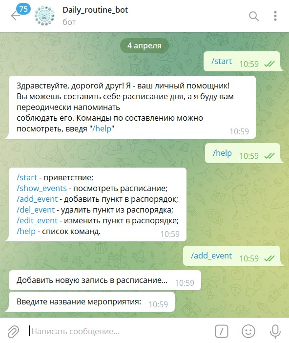
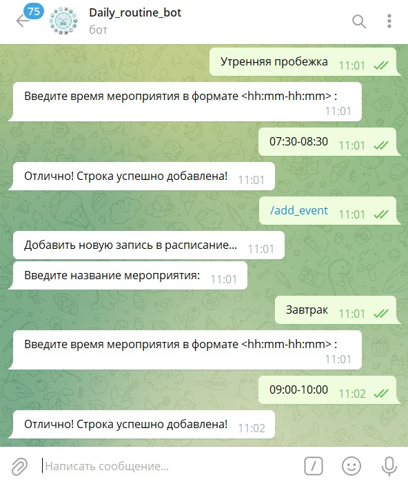
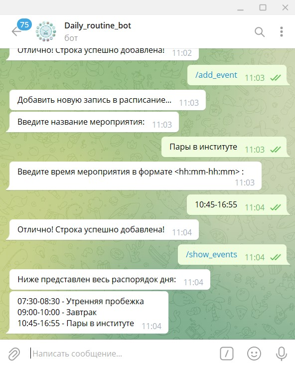
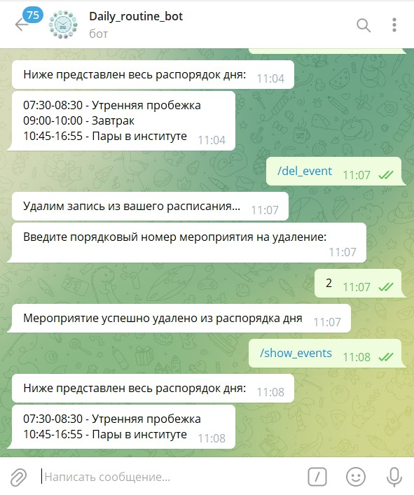

# Daily_routine_bot
## Бот, который поможет распланировать день

С помощью данного бота вы с лёгкостью сможете составить свой распорядок дня, который всегда будет у вас под рукой.
Вот список команд бота:
* /start - приветствие
* /show_events - посмотреть расписание;
* /add_event - добавить пункт в распорядок;
* /del_event - удалить пункт из распорядка;
* /edit_event - изменить пункт в распорядке;
* /help - список команд

Ниже представлена наглядная демонстрация каждой команды:
* /start, /help и /add_event

* /add_event и /show_events

>>Бот можно найти в телеграмм по ссылке http://t.me/personal_daily_routine_bot (он может быть не всегда активным, т.к. запускается на сервере)
>>> Будем очень рады, если наш бот окажется полезным для вас :)
